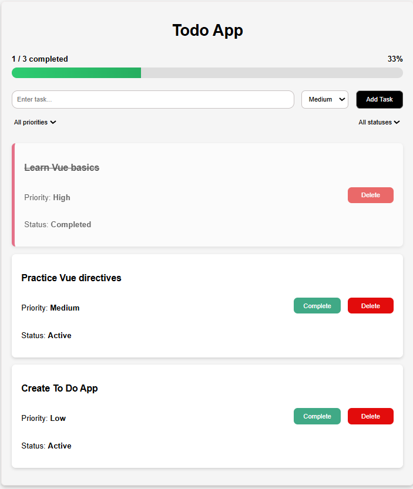

# Todo App

Todo App is a simple Vue 3 application for managing daily tasks. Users can add tasks, assign priorities, mark them as completed, delete them, and filter them by status or priority.

## Features

- Add new tasks with a title and priority
- Mark tasks as completed
- Delete tasks from the list
- Filter tasks by priority and status
- Track progress with a visual progress bar
- Show a celebration message when all tasks are completed

## Tech Stack

- Vue 3
- JavaScript
- HTML
- CSS

## Project Structure

```text
src/
├── assets/
├── components/
│   ├── ProgressBar.vue
│   └── TaskItem.vue
├── utils/
│   └── task.js
├── App.vue
└── main.js
```

## Installation

```sh
npm install
```

## Running the Project

```sh
npm run dev
```

Open the local development server in your browser to use the app.

## Screenshots



## Future Improvements

- Save tasks in local storage or a database
- Edit existing tasks
- Add due dates and reminders
- Add search and sorting options
- Improve the user interface with drag-and-drop task management
